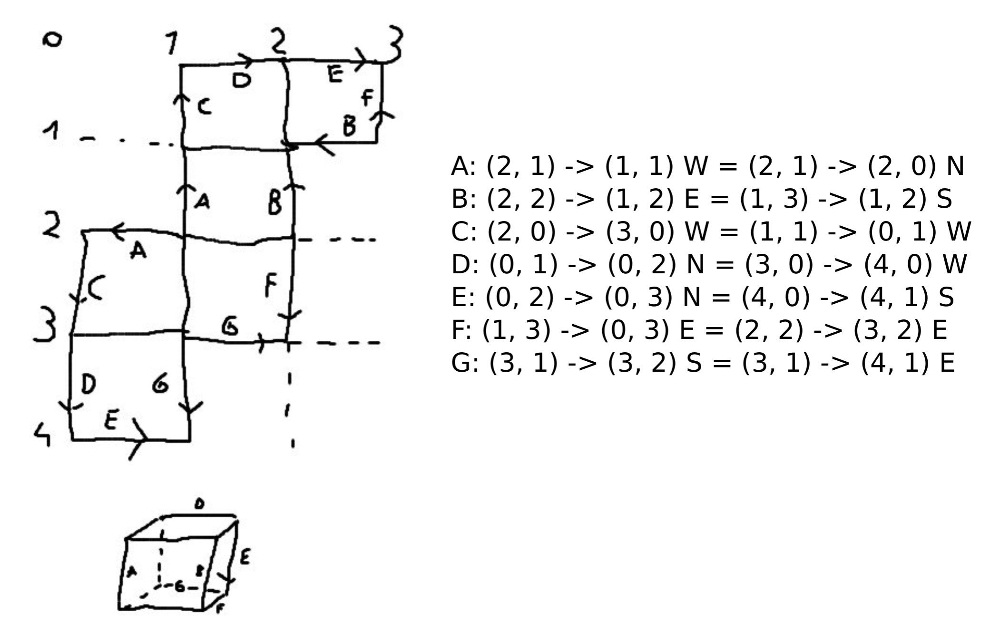

# Monkey Map

The solution for the Monkey Map problem from AoC2022 day22 is present in 'monkey_map.py'.

I went for a more functional style of programming (my initial idea was OO, but that didn't work out).
I also tried to be as clear as possible with naming variables, naming functions, type hinting and docstrings.

Python file is split into several sections:
- Any helper classes or constants at the top
- A general section with helper functions used for both part 1 and part 2
- The solution for part 1:
    - traverse the board
    - move part 1
- The solution for part 2:
    - traverse the cube
    - print cube schedule
    - move part 2
    - calculate index for a wrap over all edges
    - calculate point index on edge
    - calculate point on other edge based off index
    - VERTICE_MAP based off my own drawing of how the edges align

## Part 1

This was pretty straight forward. Spent a bit less than 1h on this solution. Did not use any external help for this.

The move_part1() function was given me some issues, so I wrote some tests to quickly implement it ('test_monkey_map.py').

## Part 2

Now this was a whole different beast.
Initially I had tried to do it Object Oriented, by creating the actual cube and having all of the cube edges there.
Each cube edge would take care of it's own grid and orientation.
This solution quickly became messy and overly complex, while I had already spent a good 2 hours on it.

As I wanted to at least have somewhat of a solution for the second part, I decided to have a look at a [this video](https://www.youtube.com/watch?v=pAtv9bAQ4uA).
This showed a great idea of not actually creating the cube, or the edges. Instead only relying on the vertices and direction of each edge.
With this new idea in mind, I retried once again, starting by drawing out the cube and calculating the vertices and edges.
This can be seen in:

With the vertex map in place, I could start to actually calculate if I would wrap around an edge. If it would wrap around the edge,
then I would calculate the matching point on the other edge, based off the index from the starting vertix to the original point.
I added more explanation in the code, and tried to add some examples in the function docstrings, to make my thought process clearer.

The solution is getting quite far, but unfortunately I'm still getting some index errors. I tried to figure what is going wrong, but it appears to be
some strange edge cases. I have already spent around 4 hours on part 2 now, and since the goal was to only spend about 2-3 hours I will call it here.
I will fix these edge cases in the future (hopefully), I would probably start by writing some more tests on an actual wrap, because I did not have the time to do so yet.

There are some concerns I have for the future I would change (marked as TODO in the code):
- VERTEX_MAP is a global constant, yet I am changing it to change the vertices from (0,1) to (0,50). Changing a constant is not done, and I would change this in the future.
- calculate_index_on_edge_for_point feels a bit multi-functional, I would split this up
- calculate_index_for_wrap feels a bit multi-functional, I would split this up